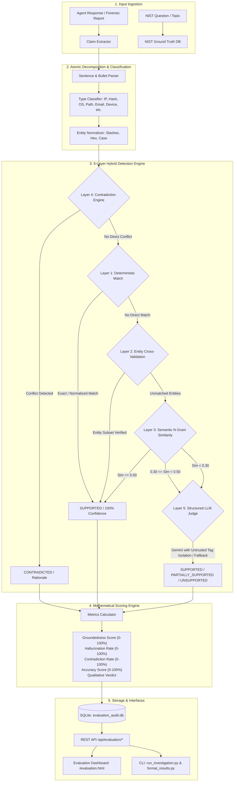

# Project Sentinel: NIST Hallucination Evaluation Module

## 1. Architectural Overview

The **Hallucination Evaluation Module** is an automated, multi-tiered verification engine designed to evaluate digital forensics agent responses against the official **NIST Computer Forensic Reference Data Sets (CFReDS) Data Leakage Case** (`leakage-answers.pdf` / `leakage-answers.docx`).

It ensures that AI-generated investigative conclusions are factually anchored to forensic ground truth, flags unsupported claims, and alerts analysts to contradictory evidence.



---

## 2. Benchmark Dataset: NIST CFReDS Data Leakage Case

The ground truth dataset is parsed from the official NIST CFReDS Data Leakage Case reference documents:
- **Reference Document:** `leakage-answers.pdf` (Version 1.32, 50 pages) and `leakage-answers.docx`.
- **Target Evidence:** Disk images `PC.raw`, `RM#1.raw`, `RM#2.raw`, `RM#3.raw`, and VSC snapshots.
- **Coverage:** All 60 official investigative questions with verified answer keys, technical considerations, artifact paths, and source page citations.
- **Location:** `reference_data/nist_ground_truth.json`.

---

## 3. Five-Layer Hybrid Detection Architecture

### Layer 1: Normalized Deterministic Matching
- **Purpose:** Eliminates lexical discrepancies without requiring LLM inference.
- **Normalizations:**
  - Forward vs. backward slash normalization for file paths (`C:\Users\...` vs `C:/Users/...`).
  - Casing, punctuation, and Unicode quotes normalization.
  - Hexadecimal normalization for MD5 and SHA-1 hashes (`a49d1254...` vs `A49D1254...`).
  - Whitespace compression and tabular markdown alignment.

### Layer 2: Entity Cross-Verification
- **Purpose:** Compares structured forensic entities against the ground truth entity set.
- **Entity Types:**
  - IP addresses (e.g., `10.11.11.129`, `10.11.11.128`)
  - Email addresses (e.g., `iaman.informant.personal@gmail.com`)
  - File names (e.g., `resignation.docx`, `snapshot.db`)
  - File and registry paths (e.g., `HKLM\SOFTWARE\Microsoft\...`)
  - System hostnames (e.g., `INFORMANT-PC`)
  - User accounts (e.g., `informant`, `Administrator`)
  - Storage device serials (e.g., `4C530012450531101593`)

### Layer 3: Semantic & N-Gram Similarity Evaluation
- **Purpose:** Evaluates paraphrased factual statements and narrative prose.
- **Techniques:**
  - Token-level overlap excluding forensic stop words.
  - Character 3-gram Jaccard similarity.
  - Best-evidence passage retrieval across ground truth answers and technical considerations.

### Layer 4: Forensic Rule & Knowledge Contradiction Detection
- **Purpose:** Identifies mutually exclusive claims and factual violations.
- **Forensic Contradiction Categories:**
  - **OS Version Conflicts:** Claiming Windows 10/11/XP when ground truth establishes Windows 7 Ultimate SP1 (Build 7601).
  - **Subnet / IP Conflicts:** Claiming `192.168.x.x` when the case network environment is strictly `10.11.11.x`.
  - **Hostname Inconsistencies:** Claiming arbitrary hostnames when the computer name is `INFORMANT-PC`.
  - **Timezone Mismatches:** Claiming conflicting time offsets against the confirmed timezone setting.
  - **Anti-Forensics Polarization:** Inverting whether an action occurred or was logged.

### Layer 5: Structured LLM Judge with Prompt Injection Isolation
- **Purpose:** Resolves subtle forensic reasoning and high-level analytical claims.
- **Security Isolation:**
  Agent outputs are enclosed in `<UNTRUSTED_AGENT_CLAIM>` tags with explicit system instructions that the text is strictly untrusted data to be audited, preventing indirect prompt injection from forensic artifacts.
- **Model Cascade:** Gemini Flash 2.5 / 2.0 / 1.5 with deterministic offline rule fallback.

---

## 4. Evaluation Metrics & Mathematical Formulation

For an evaluated response decomposed into $N$ evaluable atomic claims:

$$\text{Groundedness Score} = \frac{S + 0.5 \cdot P}{\max(1, E)} \times 100\%$$

$$\text{Hallucination Rate} = \frac{U + C}{\max(1, E)} \times 100\%$$

$$\text{Contradiction Rate} = \frac{C}{\max(1, E)} \times 100\%$$

$$\text{Accuracy Score} = \frac{S + 0.5 \cdot P}{S + P + U + C} \times 100\%$$

Where:
- $S$ = Supported claims count
- $P$ = Partially supported claims count
- $U$ = Unsupported (hallucinated) claims count
- $C$ = Contradicted claims count
- $E = S + P + U + C$ = Total evaluable claims

### Qualitative Verdict Assignment:
- **`GROUNDED` / `SUPPORTED`:** $\text{Groundedness} \ge 80\%$ and $C = 0$
- **`PARTIALLY_GROUNDED`:** $50\% \le \text{Groundedness} < 80\%$ and $C = 0$
- **`HALLUCINATED`:** $\text{Hallucination Rate} > 40\%$ and $C = 0$
- **`CONTRADICTED`:** $C \ge 1$

---

## 5. REST API Endpoints

The evaluator exposes REST endpoints on the primary server (`server.py:8080`):

| Endpoint | Method | Description |
|---|---|---|
| `/api/evaluation/questions` | `GET` | List all 60 NIST questions with ground truth metadata |
| `/api/evaluation/questions?id=<ID>` | `GET` | Get detailed ground truth for a specific question ID |
| `/api/evaluation/evaluate` | `POST` | Evaluate a single question response against NIST ground truth |
| `/api/evaluation/evaluate-report` | `POST` | Evaluate a multi-section forensic report |
| `/api/evaluation/history` | `GET` | Retrieve audit history with filtering options |
| `/api/evaluation/summary` | `GET` | Get aggregate hallucination stats and agent leaderboards |
| `/api/evaluation/run-agent` | `POST` | Execute a live forensic agent and immediately evaluate output |

---

## 6. CLI Integration

### Running Investigations with Automated Evaluation
```bash
# Run investigation and evaluate against NIST ground truth
python run_investigation.py --out outputs/investigation_results.json --evaluate

# Run specific question subset
python run_investigation.py --only 1 3 5 9 31 --evaluate
```

### Formatting Markdown Reports with Evaluation Scores
```bash
# Format existing results and calculate evaluation metrics
python format_results.py outputs/investigation_results.json --out outputs/audit_report.md --evaluate
```

---

## 7. Web Dashboard

Access the interactive dashboard at:
**[http://localhost:8080/evaluation.html](http://localhost:8080/evaluation.html)**

### Dashboard Features:
1. **Real-Time HUD Metrics:** Total evaluations, mean groundedness, hallucination rate, contradiction rate, and claim counters.
2. **Interactive Question Evaluator:** Select any of the 60 NIST questions, type/paste an answer, or click "Load Sample Ground Truth" / "Run Live Agent" to test real-time evaluation.
3. **Claim Breakdown Table:** Color-coded table displaying each extracted claim, classified type, verification status, detection layer, and matched NIST ground truth quote.
4. **60-Question Forensic Matrix:** High-density grid showing question titles, keywords, and ground truth preview.
5. **Full Report Evaluator:** Section auto-detection and comprehensive report audit generation.
6. **Agent Leaderboard:** Compares groundedness and hallucination rates across multiple agent configurations.
7. **Audit Trail & Modal Inspector:** Complete persistent log stored in `evaluation_audit.db`.
